# Bot Management System - Database Models

This document provides a comprehensive description of the database models (tables) used in the Bot Management System. The project is structured into several Django apps, each responsible for a specific domain.

## 1. Core App (`core`)

Foundational models used across the entire system.

### `Workspace` (Table: `workspace`)

The main tenant model representing a business or individual bot workspace.

- **Fields**: `owner` (User), `name`, `address`, `contact_phone`, `contact_email`, `logo_url`, `hours` (JSON), `settings` (JSON).
- **Purpose**: Central entity that most other models reference to support multi-tenancy.

### `SystemAdmin` (Table: `system_admin`)

System-level administrator accounts.

- **Fields**: `username`, `email`, `password_hash`, `role` (default: 'moderator'), `is_active`, `last_login`.
- **Purpose**: Manages the platform itself, independent of specific workspaces.

### `TelegramUser` (Table: `telegram_user`)

Generalized application user profile.

- **Fields**: `user` (Django User), `telegram_user_id` (BigInt), `name`, `email`, `phone`, `password_hash`, `role` (default: 'customer'), `workspace` (FK), `status`, `has_used_free_trial` (Boolean).
- **Purpose**: Links Django's authentication system with Telegram users. Tracks if the user has already utilized their one-time free trial.

### `AuditLog` (Table: `audit_log`)

System-wide action logging.

- **Fields**: `actor_type`, `actor_id`, `action`, `resource_type`, `resource_id`, `details` (JSON), `ip_address`.
- **Purpose**: Tracks important actions for security and debugging.

### `PlanActivationCode` (Table: `plan_activation_code`)

Unified activation code for subscription plans.

- **Fields**: `code`, `plan_name` (Free/Free Trial/Pro/Max), `code_type` (General/User-Specific), `target_user` (FK), `is_used`, `used_by` (FK), `used_at`, `created_by` (FK), `expires_at`.
- **Purpose**: Allows users to activate premium features using codes. Supports "Free Trial" codes for extended testing periods.

### `Subscription` (Table: `subscription`)

Workspace subscription tracking.

- **Fields**: `workspace` (FK), `plan_name`, `status` (active, expired, cancelled), `start_date`, `end_date`.
- **Purpose**: Manages billing and feature access for workspaces.

### `Attachment` (Table: `attachment`)

Generalized file utility for attachments.

- **Fields**: `title`, `description`, `image`, `type` (General/Medicine), `owner` (User).
- **Purpose**: Stores files and images uploaded by users.

---

## 2. Bot App (`bot_app`)

Models related to Telegram bot configuration and content.

### `BotSettings` (Table: `bot_settings`)

Configuration for a specific bot.

- **Fields**: `owner` (User), `workspace_name`, `telegram_token`, `bot_username`, `is_active`, `is_connected`, `interactions_count`, `questions_count`, `active_users_count`, `welcome_message`, `fallback_message`, `start_keywords`, `working_hours_start`, `working_hours_end`, `language`, `contact_info`, `home_keyboard_type`.
- **Purpose**: Stores all settings and metrics for a Telegram bot.

### `FAQCategory` (Table: `bot_faq_category`)

Categories for organizing FAQs.

- **Fields**: `bot` (FK), `workspace` (FK), `name`, `parent` (Self-FK), `keyboard_type`.
- **Purpose**: Hierarchical structure for bot menus and FAQs.

### `FAQ` (Table: `bot_faq`)

Frequently Asked Questions.

- **Fields**: `bot` (FK), `workspace` (FK), `category` (FK), `question`, `answer`, `is_active`.
- **Purpose**: Stores Q&A pairs that the bot can respond with.

### `BotPage` (Table: `bot_page`)

Pages within a category.

- **Fields**: `category` (FK), `name`.
- **Purpose**: Container for grouping content within a category.

### `PageGroup` (Table: `bot_page_group`)

Groups within a page.

- **Fields**: `page` (FK), `name`, `image`, `attachments` (M2M), `medicines` (M2M), `contact_bot_username`.
- **Purpose**: A content block that can contain multiple files or products.

---

## 3. E-commerce App (`ecom`)

Models for product catalog, inventory, and orders.

### `Category` (Table: `category`)

Product categories.

- **Fields**: `workspace` (FK), `name`, `slug`, `description`.
- **Purpose**: Categorization for products/medicines.

### `Medicine` (Table: `medicine`)

Product catalog (specifically medicines).

- **Fields**: `bot` (FK), `workspace` (FK), `category` (FK), `sku`, `name`, `brand`, `generic_name`, `description`, `dosage_form`, `strength`, `price`, `currency`, `visible`, `stock_quantity`, `low_stock_threshold`, `image`, `metadata` (JSON).
- **Purpose**: Main product entity.

### `PriceHistory` (Table: `price_history`)

Tracks price changes over time.

- **Fields**: `medicine` (FK), `old_price`, `new_price`, `changed_by_user` (FK).
- **Purpose**: Audit trail for pricing updates.

### `InventoryTransaction` (Table: `inventory_transaction`)

Stock movement tracking.

- **Fields**: `medicine` (FK), `workspace` (FK), `delta` (change amount), `reason`, `reference_id`, `performed_by` (FK).
- **Purpose**: Logs all inventory additions and deductions.

### `Order` (Table: `order`)

Customer orders.

- **Fields**: `workspace` (FK), `user` (FK), `medicine` (FK), `quantity`, `total_price`, `status` (pending, etc.), `metadata` (JSON).
- **Purpose**: Records purchase requests from users.

### `OrderItem` (Table: `order_item`)

Line items for orders.

- **Fields**: `order` (FK), `medicine` (FK), `quantity`, `unit_price`, `total_price`.
- **Purpose**: Detailed breakdown of items in an order.

---

## 4. AI Service App (`ai_service`)

Models for AI/ML features.

### `AIModel` (Table: `ai_model`)

AI model configuration.

- **Fields**: `workspace` (FK), `name`, `provider` (e.g., OpenAI), `model_id`, `config` (JSON), `is_active`.
- **Purpose**: Configures which AI models are available for use.

### `AIPromptTemplate` (Table: `ai_prompt_template`)

Reusable prompt templates.

- **Fields**: `workspace` (FK), `name`, `template`, `description`, `is_active`.
- **Purpose**: Stores standard prompts for consistent AI behavior.

### `AIDocument` (Table: `ai_document`)

Knowledge base documents.

- **Fields**: `workspace` (FK), `title`, `content`, `metadata` (JSON), `source`.
- **Purpose**: Raw text data for RAG (Retrieval-Augmented Generation).

### `AIEmbedding` (Table: `ai_embedding`)

Vector embeddings storage.

- **Fields**: `workspace` (FK), `chunk`, `vector` (JSON), `source_type`, `source_id`.
- **Purpose**: Stores vector representations of documents for semantic search.

### `AIRequest` (Table: `ai_request`)

AI request logging.

- **Fields**: `workspace` (FK), `model` (FK), `user` (FK), `prompt`, `tokens`, `cost`, `latency_ms`, `response_preview`.
- **Purpose**: Analytics and cost tracking for AI usage.

### `AIResponse` (Table: `ai_response`)

AI response storage.

- **Fields**: `workspace` (FK), `user_message`, `ai_answer`, `source_model`.
- **Purpose**: History of AI interactions.

### `AIModeration` (Table: `ai_moderation`)

Content moderation logging.

- **Fields**: `ai_response` (FK), `violations` (JSON), `category`, `action_taken`.
- **Purpose**: Tracks safety violations and moderation actions.

---

## 5. Admin App (`admin_app`)

System administration models.

### `SystemNotification` (Table: `admin_app_systemnotification`)

System-wide notifications.

- **Fields**: `title`, `message`, `notification_type` (in_app, email, both), `sent_by` (FK).
- **Purpose**: Announcements to users.

---

## 6. Project Structure Overview

### Database Structure (Tables)

```text
└── bot_management_db
    ├── workspace (Workspace)
    ├── system_admin
    ├── telegram_user
    ├── audit_log
    ├── plan_activation_code
    ├── subscription
    ├── attachment
    ├── bot_settings
    ├── bot_faq_category
    ├── bot_faq
    ├── bot_page
    ├── bot_page_group
    ├── category
    ├── medicine
    ├── price_history
    ├── inventory_transaction
    ├── order
    ├── order_item
    ├── ai_model
    ├── ai_prompt_template
    ├── ai_document
    ├── ai_embedding
    ├── ai_request
    ├── ai_response
    ├── ai_moderation
    └── admin_app_systemnotification
```

### Project App Structure (Models)

```text
└── Bot Management System
    ├── core
    │   ├── Workspace
    │   ├── SystemAdmin
    │   ├── TelegramUser
    │   ├── AuditLog
    │   ├── PlanActivationCode
    │   ├── Subscription
    │   └── Attachment
    ├── bot_app
    │   ├── BotSettings
    │   ├── FAQCategory
    │   ├── FAQ
    │   ├── BotPage
    │   └── PageGroup
    ├── ecom
    │   ├── Category
    │   ├── Medicine
    │   ├── PriceHistory
    │   ├── InventoryTransaction
    │   ├── Order
    │   └── OrderItem
    ├── ai_service
    │   ├── AIModel
    │   ├── AIPromptTemplate
    │   ├── AIDocument
    │   ├── AIEmbedding
    │   ├── AIRequest
    │   ├── AIResponse
    │   └── AIModeration
    └── admin_app
        └── SystemNotification
```

---

## 7. Entity Relationship Diagram (ERD)

```mermaid
erDiagram
    %% Core App
    Workspace {
        uuid id PK
        string name
        string address
        string contact_phone
        string contact_email
        string logo_url
        json hours
        json settings
        datetime created_at
        datetime updated_at
    }
    SystemAdmin {
        uuid id PK
        string username
        string email
        string password_hash
        string role
        boolean is_active
        datetime last_login
    }
    TelegramUser {
        uuid id PK
        bigint telegram_user_id
        string name
        string email
        string phone
        string password_hash
        string role
        string status
        boolean has_used_free_trial
        datetime created_at
    }
    AuditLog {
        uuid id PK
        string actor_type
        string actor_id
        string action
        string resource_type
        string resource_id
        json details
        string ip_address
    }
    PlanActivationCode {
        uuid id PK
        string code
        string plan_name
        string code_type
        boolean is_used
        datetime used_at
        datetime expires_at
    }
    Subscription {
        uuid id PK
        string plan_name
        string status
        date start_date
        date end_date
    }
    Attachment {
        int id PK
        string title
        string description
        string image
        string type
        datetime created_at
    }

    %% Relationships Core
    Workspace ||--o| User : owner
    TelegramUser }|--|| Workspace : belongs_to
    TelegramUser ||--o| User : linked_django_user
    PlanActivationCode }|--o| TelegramUser : target_user
    PlanActivationCode }|--o| TelegramUser : used_by
    PlanActivationCode }|--o| SystemAdmin : created_by
    Subscription }|--|| Workspace : has
    Attachment }|--|| User : uploaded_by

    %% Bot App
    BotSettings {
        uuid id PK
        string workspace_name
        string telegram_token
        string bot_username
        boolean is_active
        boolean is_connected
        int interactions_count
        string language
        string home_keyboard_type
    }
    FAQCategory {
        uuid id PK
        string name
        string keyboard_type
    }
    FAQ {
        uuid id PK
        string question
        string answer
        boolean is_active
    }
    BotPage {
        uuid id PK
        string name
    }
    PageGroup {
        uuid id PK
        string name
        string image
        string contact_bot_username
    }

    %% Relationships Bot
    BotSettings }|--|| User : owner
    FAQCategory }|--|| BotSettings : belongs_to
    FAQCategory }|--|| Workspace : belongs_to
    FAQCategory |o--o| FAQCategory : parent
    FAQ }|--|| BotSettings : belongs_to
    FAQ }|--|| Workspace : belongs_to
    FAQ }|--o| FAQCategory : categorized_in
    BotPage }|--|| FAQCategory : inside
    PageGroup }|--|| BotPage : inside
    PageGroup }|--o{ Attachment : contains
    PageGroup }|--o{ Medicine : contains

    %% E-commerce App
    Category {
        uuid id PK
        string name
        string slug
        string description
    }
    Medicine {
        uuid id PK
        string sku
        string name
        string brand
        decimal price
        int stock_quantity
        boolean visible
    }
    PriceHistory {
        uuid id PK
        decimal old_price
        decimal new_price
        datetime changed_at
    }
    InventoryTransaction {
        uuid id PK
        int delta
        string reason
        string reference_id
    }
    Order {
        uuid id PK
        int quantity
        decimal total_price
        string status
        json metadata
    }
    OrderItem {
        uuid id PK
        int quantity
        decimal unit_price
        decimal total_price
    }

    %% Relationships Ecom
    Category }|--o| Workspace : belongs_to
    Medicine }|--o| BotSettings : displayed_in
    Medicine }|--|| Workspace : belongs_to
    Medicine }|--o| Category : classified_as
    PriceHistory }|--|| Medicine : tracks
    InventoryTransaction }|--|| Medicine : affects
    InventoryTransaction }|--|| Workspace : in
    Order }|--|| Workspace : in
    Order }|--o| TelegramUser : placed_by
    Order }|--o| Medicine : for_product
    OrderItem }|--|| Order : part_of
    OrderItem }|--|| Medicine : contains

    %% AI Service
    AIModel {
        uuid id PK
        string name
        string provider
        string model_id
        json config
    }
    AIPromptTemplate {
        uuid id PK
        string name
        string template
    }
    AIDocument {
        uuid id PK
        string title
        string content
        string source
    }
    AIEmbedding {
        uuid id PK
        string chunk
        json vector
    }
    AIRequest {
        uuid id PK
        string prompt
        int prompt_tokens
        int completion_tokens
        decimal total_cost
    }
    AIResponse {
        uuid id PK
        string user_message
        string ai_answer
    }
    AIModeration {
        uuid id PK
        json violations
        string category
    }

    %% Relationships AI
    AIModel }|--o| Workspace : available_in
    AIPromptTemplate }|--|| Workspace : belongs_to
    AIDocument }|--|| Workspace : knowledge_base
    AIEmbedding }|--|| Workspace : vectors
    AIRequest }|--o| Workspace : logged_in
    AIRequest }|--o| AIModel : uses
    AIRequest }|--o| TelegramUser : triggered_by
    AIResponse }|--|| Workspace : stored_in
    AIModeration }|--|| AIResponse : checks

    %% Admin App
    SystemNotification {
        int id PK
        string title
        string message
        string notification_type
    }

    %% Relationships Admin
    SystemNotification }|--o| SystemAdmin : sent_by
```



---

## 8. Database Structure (DBML)

Copy the code below and paste it into [dbdiagram.io](https://dbdiagram.io/) to generate a visual database diagram.

```dbml
// ==========================================
// Core App
// ==========================================

Table Workspace {
  id uuid [pk]
  name varchar
  address text
  contact_phone varchar
  contact_email varchar
  logo_url varchar
  hours json
  settings json
  created_at timestamp
  updated_at timestamp
  owner_id int [ref: - User.id]
}

Table SystemAdmin {
  id uuid [pk]
  username varchar
  email varchar
  password_hash varchar
  role varchar
  is_active boolean
  last_login timestamp
}

Table TelegramUser {
  id uuid [pk]
  telegram_user_id bigint
  name varchar
  email varchar
  phone varchar
  password_hash varchar
  role varchar
  status varchar
  has_used_free_trial boolean
  created_at timestamp
  user_id int [ref: - User.id]
  workspace_id uuid [ref: > Workspace.id]
}

Table AuditLog {
  id uuid [pk]
  actor_type varchar
  actor_id varchar
  action varchar
  resource_type varchar
  resource_id varchar
  details json
  ip_address varchar
  created_at timestamp
}

Table PlanActivationCode {
  id uuid [pk]
  code varchar
  plan_name varchar
  code_type varchar
  target_user_id uuid [ref: > TelegramUser.id]
  is_used boolean
  used_by_id uuid [ref: > TelegramUser.id]
  used_at timestamp
  created_by_id uuid [ref: > SystemAdmin.id]
  created_at timestamp
  expires_at timestamp
}

Table Subscription {
  id uuid [pk]
  plan_name varchar
  status varchar
  start_date date
  end_date date
  workspace_id uuid [ref: > Workspace.id]
}

Table Attachment {
  id int [pk]
  title varchar
  description text
  image varchar
  type varchar
  created_at timestamp
  owner_id int [ref: > User.id]
}

// ==========================================
// Bot App
// ==========================================

Table BotSettings {
  id uuid [pk]
  workspace_name varchar
  telegram_token varchar
  bot_username varchar
  is_active boolean
  is_connected boolean
  interactions_count int
  questions_count int
  active_users_count int
  language varchar
  home_keyboard_type varchar
  start_keywords text
  owner_id int [ref: > User.id]
}

Table FAQCategory {
  id uuid [pk]
  name varchar
  keyboard_type varchar
  bot_id uuid [ref: > BotSettings.id]
  workspace_id uuid [ref: > Workspace.id]
  parent_id uuid [ref: > FAQCategory.id]
}

Table FAQ {
  id uuid [pk]
  question text
  answer text
  is_active boolean
  bot_id uuid [ref: > BotSettings.id]
  workspace_id uuid [ref: > Workspace.id]
  category_id uuid [ref: > FAQCategory.id]
}

Table BotPage {
  id uuid [pk]
  name varchar
  category_id uuid [ref: > FAQCategory.id]
}

Table PageGroup {
  id uuid [pk]
  name varchar
  image varchar
  contact_bot_username varchar
  page_id uuid [ref: > BotPage.id]
}

// Many-to-Many Relationships for PageGroup
Table PageGroup_Attachment {
  pagegroup_id uuid [ref: > PageGroup.id]
  attachment_id int [ref: > Attachment.id]
}

Table PageGroup_Medicine {
  pagegroup_id uuid [ref: > PageGroup.id]
  medicine_id uuid [ref: > Medicine.id]
}

// ==========================================
// E-commerce App
// ==========================================

Table Category {
  id uuid [pk]
  name varchar
  slug varchar
  description text
  workspace_id uuid [ref: > Workspace.id]
}

Table Medicine {
  id uuid [pk]
  sku varchar
  name varchar
  brand varchar
  generic_name varchar
  description text
  dosage_form varchar
  strength varchar
  price decimal
  currency varchar
  visible boolean
  stock_quantity int
  low_stock_threshold int
  image varchar
  metadata json
  bot_id uuid [ref: > BotSettings.id]
  workspace_id uuid [ref: > Workspace.id]
  category_id uuid [ref: > Category.id]
}

Table PriceHistory {
  id uuid [pk]
  old_price decimal
  new_price decimal
  changed_at timestamp
  medicine_id uuid [ref: > Medicine.id]
  changed_by_user_id uuid [ref: > TelegramUser.id]
}

Table InventoryTransaction {
  id uuid [pk]
  delta int
  reason varchar
  reference_id varchar
  created_at timestamp
  medicine_id uuid [ref: > Medicine.id]
  workspace_id uuid [ref: > Workspace.id]
  performed_by_id uuid [ref: > TelegramUser.id]
}

Table Order {
  id uuid [pk]
  quantity int
  total_price decimal
  status varchar
  metadata json
  created_at timestamp
  updated_at timestamp
  workspace_id uuid [ref: > Workspace.id]
  user_id uuid [ref: > TelegramUser.id]
  medicine_id uuid [ref: > Medicine.id]
}

Table OrderItem {
  id uuid [pk]
  quantity int
  unit_price decimal
  total_price decimal
  order_id uuid [ref: > Order.id]
  medicine_id uuid [ref: > Medicine.id]
}

// ==========================================
// AI Service App
// ==========================================

Table AIModel {
  id uuid [pk]
  name varchar
  provider varchar
  model_id varchar
  config json
  is_active boolean
  workspace_id uuid [ref: > Workspace.id]
}

Table AIPromptTemplate {
  id uuid [pk]
  name varchar
  template
}

Table AIDocument {
  id uuid [pk]
  title
  content
  source
}

Table AIEmbedding {
  id uuid [pk]
  chunk
  vector json
}

Table AIRequest {
  id uuid [pk]
  prompt
  prompt_tokens int
  completion_tokens int
  total_cost decimal
}

Table AIResponse {
  id uuid [pk]
  user_message
  ai_answer
}

Table AIModeration {
  id uuid [pk]
  violations json
  category
}

// ==========================================
// Admin App
// ==========================================

Table SystemNotification {
  id int [pk]
  title varchar
  message varchar
  notification_type varchar
  sent_by_id uuid [ref: > SystemAdmin.id]
}
```

